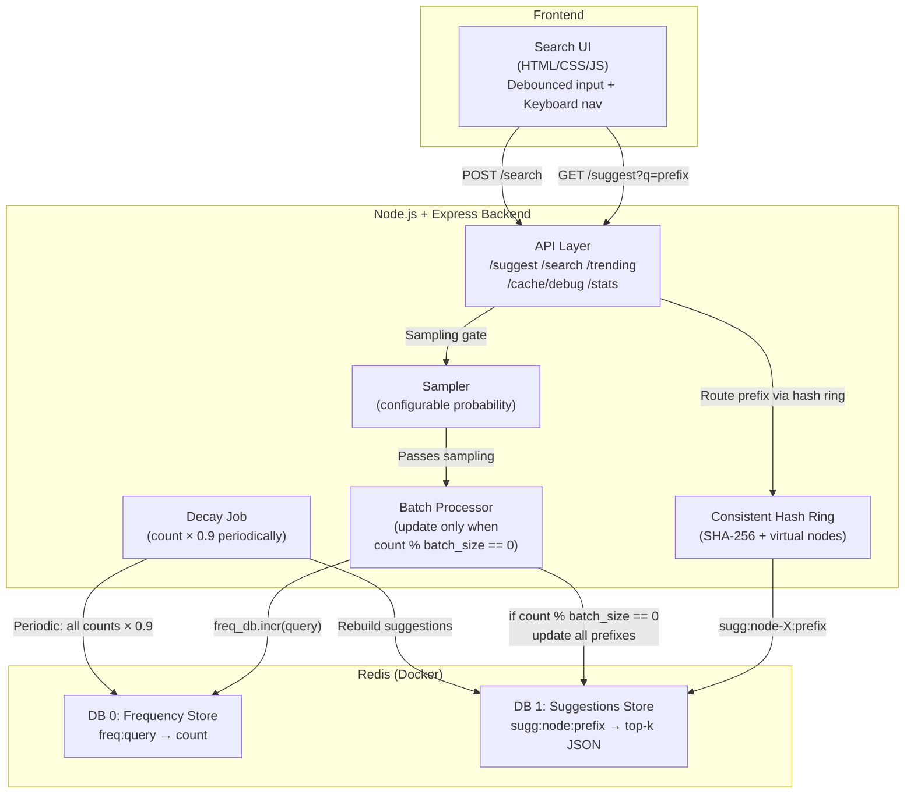

# Search Typeahead System — Final Implementation Plan

## Overview

**Tech Stack:**
- **Backend**: Node.js + Express
- **Data Store**: Redis (via Docker) — two logical databases
- **Cache Distribution**: Consistent hashing across 3 logical cache nodes (all within Redis)
- **Frontend**: Vanilla HTML + CSS + JS (premium dark-mode UI)
- **Dataset**: Synthetic 120K+ queries generated via script

**Two Redis Databases (matching class notes):**

| Redis DB | Purpose | Key Pattern |
|----------|---------|-------------|
| **DB 0 — Frequency Store** | `query → count` (search frequency) | `freq:<query>` |
| **DB 1 — Suggestions Store** | `prefix → top-k suggestions` (precomputed cache) | `sugg:<node>:<prefix>` |

**Docker Setup**: Single `docker-compose.yml` → `docker compose up` → Redis is ready.

---

## Architecture



---

## Proposed Changes

### Project Structure

```
c:\_My Data\HLD/
├── docker-compose.yml              # Redis container
├── package.json
├── .env                            # Config (batch size, decay, sample rate)
├── README.md
├── server.js                       # Express entry point
├── src/
│   ├── redis.js                    # Redis client setup
│   ├── frequencyStore.js           # DB 0: query → count operations
│   ├── suggestionsStore.js         # DB 1: prefix → top-k operations
│   ├── consistentHash.js           # Hash ring (from scratch)
│   ├── distributedCache.js         # Cache layer using consistent hashing
│   ├── batchProcessor.js           # count % batch_size logic
│   ├── sampler.js                  # rand() < rate sampling
│   ├── decayJob.js                 # Periodic decay (count × 0.9)
│   ├── prefixUtils.js              # Extract prefixes from query
│   ├── metrics.js                  # Latency, hit rate, write counts
│   └── routes/
│       ├── suggest.js              # GET /suggest?q=<prefix>
│       ├── search.js               # POST /search
│       ├── trending.js             # GET /trending
│       ├── cacheDebug.js           # GET /cache/debug?prefix=<prefix>
│       └── stats.js                # GET /stats
├── scripts/
│   └── generateDataset.js          # Generate 120K+ queries
├── data/
│   └── queries.csv                 # Generated dataset
├── public/
│   ├── index.html
│   ├── style.css
│   └── app.js
└── docs/
    └── architecture.md
```

---

### Docker Setup

#### [NEW] docker-compose.yml
```yaml
services:
  redis:
    image: redis:7-alpine
    ports:
      - "6379:6379"
    volumes:
      - redis_data:/data
volumes:
  redis_data:
```

Run: `docker compose up -d` → Redis on `localhost:6379`

---

### Core Components (all [NEW])

| File | Purpose | Class Concept |
|------|---------|---------------|
| `redis.js` | Redis client connection (using `ioredis`) | Redis as key-value DB |
| `frequencyStore.js` | `INCR freq:<query>`, `GET freq:<query>`, `SCAN` for decay | `redis.inc(searchQuery)` |
| `suggestionsStore.js` | Store/retrieve top-k JSON per prefix | Precomputed prefix → suggestions |
| `consistentHash.js` | SHA-256 ring, virtual nodes, binary search | Consistent hashing for sharding |
| `distributedCache.js` | Route prefix to `sugg:node-X:prefix` via hash ring | Distributed cache |
| `batchProcessor.js` | `if (count % BATCH_SIZE === 0)` update prefixes | Batching from class |
| `sampler.js` | `if (Math.random() < RATE)` gate | Sampling from class |
| `decayJob.js` | `SCAN` all freq keys, multiply by 0.9, rebuild suggestions | Decay-based trending |
| `prefixUtils.js` | `"what does" → ["w","wh","wha",...,"what does"]` | Prefix extraction |
| `metrics.js` | p95 latency, cache hit/miss, write reduction | Performance reporting |

---

### API Routes (all [NEW])

| Route | File | Behavior |
|-------|------|----------|
| `GET /suggest?q=<prefix>` | `routes/suggest.js` | Hash prefix → check cache node → miss: query suggestions store → return top 10 |
| `POST /search` | `routes/search.js` | Apply sampling → `INCR` freq → batch check → return `{ message: "Searched" }` |
| `GET /trending` | `routes/trending.js` | Return top 10 queries by decayed count |
| `GET /cache/debug?prefix=<prefix>` | `routes/cacheDebug.js` | Show hash value, target node, hit/miss, TTL, ring distribution |
| `GET /stats` | `routes/stats.js` | Latency percentiles, cache hit rate, write reduction, decay info |

---

### Frontend (all [NEW])

| File | What it includes |
|------|-----------------|
| `public/index.html` | Search bar, suggestion dropdown, trending section, stats dashboard |
| `public/style.css` | Premium dark-mode, glassmorphism, gradient animations |
| `public/app.js` | Debounced input (300ms), keyboard nav (↑↓ Enter Esc), fetch API calls |

---

### Dataset Generator

#### [NEW] scripts/generateDataset.js
- 120K+ unique queries across 10+ categories
- Zipf-distributed counts (realistic distribution)
- Output: `data/queries.csv`

---

## Grading Coverage

| Component (Marks) | Implementation |
|---|---|
| **Basic (60)** | Redis frequency + suggestions stores, consistent hashing cache, suggest API, search API, UI |
| **Trending (20)** | Decay job (×0.9), trending endpoint, live trending section in UI |
| **Batch Writes (20)** | `count % batch_size` batching + sampling, write reduction stats, failure trade-off in docs |

---

## Verification Plan

```bash
# 1. Start Redis
docker compose up -d

# 2. Install deps & seed data
npm install
npm run seed    # generates + loads 120K queries

# 3. Start server
npm start

# 4. Test APIs
curl "http://localhost:3000/suggest?q=iph"
curl -X POST http://localhost:3000/search -H "Content-Type: application/json" -d '{"query":"iphone 16"}'
curl "http://localhost:3000/trending"
curl "http://localhost:3000/cache/debug?prefix=iph"
curl "http://localhost:3000/stats"
```
